# 🤖 小说作者 Agent — 完整架构设计方案
## 面向 500 万字长篇小说的全流程 AI 写作系统

---

## 一、项目概述

构建一个基于 LLM 的 AI 小说写作助手 Web 应用，**专为 500 万字量级的长篇小说设计**。核心要解决三个根本问题：

1. **超长上下文管理** — LLM 上下文窗口有限（即使 200K tokens 也只约 15 万字），如何让 AI 在写作第 500 章时还记得第 1 章的细节
2. **前后一致性** — 500 万字的体量中，角色性格、外貌、能力不能前后矛盾，时间线不能错乱，世界观规则不能违背
3. **首尾呼应** — 伏笔在恰当的时候回收，情节弧线完整，故事从头到尾是一个有机整体

### 核心思路：多层记忆 + 故事圣经 + 世界书动态注入

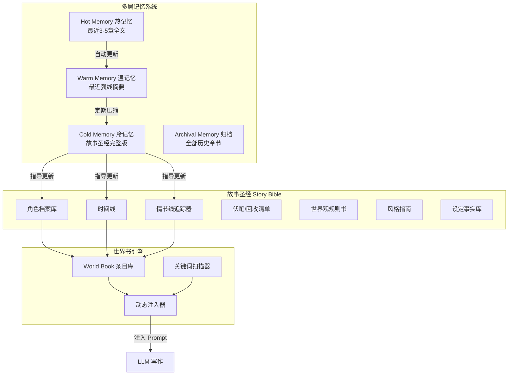

---

## 二、技术栈

| 层级 | 技术选型 | 说明 |
|------|----------|------|
| **框架** | Next.js 14+ (App Router) | 全栈框架，前后端一体 |
| **前端 UI** | Tailwind CSS + shadcn/ui | 快速构建美观界面 |
| **数据库** | SQLite (via Prisma ORM) | 本地优先，后续可迁 PostgreSQL |
| **向量数据库** | ChromaDB / pgvector | 语义搜索，用于相似情节/角色检索 |
| **全文搜索** | SQLite FTS5 | 全文关键词搜索 |
| **API 层** | Next.js API Routes | RESTful 风格 |
| **状态管理** | React Context + SWR | 轻量级数据获取与缓存 |
| **LLM 集成** | 适配器模式 (Adapter Pattern) | 参考已有 [`my-hermes-agent`](../my-hermes-agent/models/base.py) 的多模型架构 |
| **内容存储** | Markdown + Tiptap 编辑器 | 富文本编辑体验 |

---

## 三、核心架构：五层记忆系统

这是整个系统的核心，解决 "LLM 记不住 500 万字" 的根本问题。

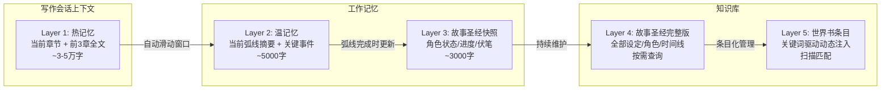

### 3.1 热记忆 (Hot Memory) — 精确层

| 属性 | 说明 |
|------|------|
| **内容** | 当前正在写的章节全文 + 前 3-5 章全文 |
| **大小** | 约 3-5 万字（取决于 token 预算） |
| **更新方式** | 滑动窗口：写完一章，最老的一章移出热记忆 |
| **用途** | 确保近期情节无缝衔接，细节精确一致 |
| **注入方式** | 直接作为 context 全文注入 |

### 3.2 温记忆 (Warm Memory) — 摘要层

| 属性 | 说明 |
|------|------|
| **内容** | 当前故事弧线 (Story Arc) 的摘要、关键转折点、重要对话 |
| **大小** | 约 5000 字 |
| **更新方式** | 每章完成后自动生成摘要；弧线完成后压缩为弧线摘要 |
| **用途** | 让 AI 理解当前弧线的整体走向 |
| **注入方式** | 结构化摘要注入 |

### 3.3 故事圣经 (Story Bible) — 事实层

故事圣经是 500 万字长篇小说的 "架构蓝图"，由系统自动维护，包含以下子模块：

#### 3.3.1 角色档案库

```
角色: 林夜
├── 基础信息: 男, 18岁→22岁(随时间变化), 黑发黑瞳
├── 外貌: 身高178cm(初期)→185cm(后期), 左眉有旧伤疤(第3章获得)
├── 性格: 沉稳→逐渐开朗(受小师妹影响), 怕鬼(贯穿全书)
├── 能力:
│   ├── 初期: 冰霜魔法Lv.1, 剑术入门
│   ├── 中期: 冰霜魔法Lv.5(第50章突破), 剑术大师, 获得「霜叹」剑
│   └── 后期: 冰霜魔法Lv.9, 领悟「永冻领域」(第300章)
├── 关系:
│   ├── 师尊·白月: 师徒→亦父亦子(第100章揭示真相)
│   ├── 小师妹·苏晴: 青梅→恋人(第200章表白)
│   └── 宿敌·夜无痕: 仇敌→亦敌亦友(第400章和解)
├── 重要变化:
│   ├── 第80章: 失去左臂→第120章: 获得冰晶义肢
│   └── 第250章: 觉醒血脉→性格转变
└── 已回收伏笔:
    ├── 左臂伏笔: 埋于第15章, 回收于第80章 ✓
    └── 血脉伏笔: 埋于第1章, 回收于第250章 ✓
```

#### 3.3.2 时间线

```
第一卷「冰霜初现」(1-80章): 时间跨度 3个月
├── 第1章: 林夜入门测试, 展现冰系天赋
├── 第15章: 遭遇暗影议会袭击, 左臂受伤(伏笔)
├── 第50章: 冰霜魔法突破Lv.5, 获得「霜叹」
└── 第80章: 北境沦陷, 断臂逃亡(弧线高潮)

第二卷「北境流亡」(81-200章): 时间跨度 1年
├── 第81-100章: 流亡与重生, 获冰晶义肢
├── 第120章: 冰晶义肢完成
├── 第150章: 结识新同伴
└── 第200章: 林夜×苏晴表白 (弧线高潮)

...

第六卷「终焉之战」(450-500章): 时间跨度 1个月
├── 第480章: 决战前夕, 全员集结
├── 第490章: 最终之战
├── 第495章: 伏笔总回收
└── 第500章: 尾声·新纪元
```

#### 3.3.3 情节线追踪器

```
情节线: 暗影议会阴谋
├── 状态: ████████░░ 80% (第四卷中)
├── 关键节点:
│   ├── [已] 第15章: 首次登场, 袭击林夜
│   ├── [已] 第80章: 揭示是北境沦陷主谋
│   ├── [已] 第200章: 暗影议会内部出现分歧
│   ├── [已] 第350章: 首领身份揭露——竟是师尊
│   └── [待] 第480章: 最终对决
├── 相关角色: 夜无痕(成员), 白月(首领), 林夜(目标)
└── 平行事件: 林夜血脉觉醒(削弱暗影控制)

情节线: 林夜身世之谜
├── 状态: ██████░░░░ 60% (已揭示, 未完全收束)
├── 关键节点:
│   ├── [已] 第1章: 开篇暗示(伏笔)
│   ├── [已] 第100章: 师尊揭露林夜身世
│   ├── [已] 第250章: 血脉觉醒, 获得远古记忆
│   └── [待] 第450章: 宿命对决·了解真相
└── 关联伏笔: 第30章梦中低语→第250章揭示为血脉记忆

情节线: 苏晴的成长
├── 状态: ██████░░░░ 60%
└── ...
```

#### 3.3.4 伏笔/回收清单

```
┌─────────┬──────────┬──────────┬────────┬────────┐
│ 伏笔     │ 埋下章节 │ 类型     │ 状态   │ 回收章节 │
├─────────┼──────────┼──────────┼────────┼────────┤
│ 梦中低语  │ 第30章   │ 身世暗示 │ ✅ 已回收│ 第250章 │
│ 锈色钥匙  │ 第45章   │ 物品伏笔 │ ⏳ 待回收│ 预计450章│
│ 神秘老者  │ 第67章   │ 角色伏笔 │ ❌ 未回收│ -       │
│ 七夜预言  │ 第90章   │ 情节伏笔 │ ✅ 已回收│ 第400章 │
│ 冰晶的诅咒│ 第120章  │ 能力代价 │ ⏳ 待回收│ 预计430章│
└─────────┴──────────┴──────────┴────────┴────────┘
```

#### 3.3.5 风格指南

```
小说: 《冰霜纪元》
├── 叙事视角: 第三人称有限视角(以林夜为主)
├── 时态: 过去时
├── 对话风格:
│   ├── 林夜: 简洁, 务实, 少言
│   ├── 苏晴: 活泼, 话多, 喜欢用比喻
│   └── 夜无痕: 冷峻, 每一个字都有分量
├── 描写倾向:
│   ├── 环境: 注重感官描写(寒冷/风/光线)
│   ├── 战斗: 快节奏, 短句为主, 注重动作细节
│   └── 情感: 内敛, 通过行动而非直白表达
├── 常用词汇:
│   ├── 高频: 霜, 寒, 冰晶, 北风
│   └── 禁忌: 避免现代用语, 保持古风但不过度
└── 段落节奏:
    ├── 日常: 中长段落, 舒缓
    ├── 战斗: 短段落, 急促
    └── 情感: 中短段落, 留白
```

### 3.4 冷记忆 (Cold Memory) — 知识库层

完整的故事圣经全文（可能达到数万字），存储在数据库中不注入到 Prompt，而是通过以下方式访问：

- **向量检索**：用语义搜索找到相关条目
- **关键词检索**：用 SQLite FTS5 全文搜索
- **按需加载**：仅在需要时查询特定条目

### 3.5 记忆更新流程

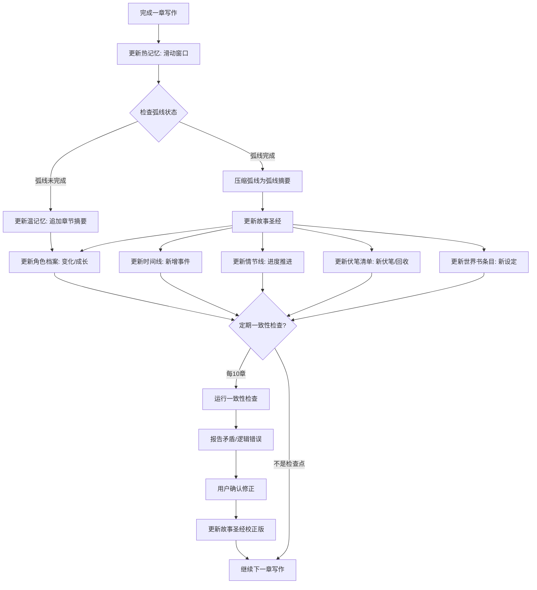

---

## 四、数据模型设计

```mermaid
erDiagram
    Project {
        string id PK
        string title
        string description
        string genre
        string targetAudience
        int wordCountGoal "5000000"
        string writingStyle
        string status "draft|active|completed"
        datetime createdAt
        datetime updatedAt
    }

    Volume {
        string id PK
        string projectId FK
        string title
        int volumeNumber
        string summary
        int chapterStart
        int chapterEnd
        string status "planned|writing|completed"
        datetime createdAt
        datetime updatedAt
    }

    Arc {
        string id PK
        string projectId FK
        string volumeId FK
        string title
        string description
        int arcNumber
        string status "planned|writing|completed"
        string summary "弧线完成后自动生成"
        datetime createdAt
        datetime updatedAt
    }

    Chapter {
        string id PK
        string projectId FK
        string arcId FK
        string title
        int chapterNumber
        string content "markdown"
        string summary "AI 自动生成的摘要"
        string status "draft|revised|final"
        string pov
        string setting
        int wordCount
        json keyEvents "本章关键事件列表"
        json newClues "新埋下的伏笔"
        json resolvedClues "已回收的伏笔"
        datetime createdAt
        datetime updatedAt
    }

    Character {
        string id PK
        string projectId FK
        string name
        string basics "基础信息: 年龄/性别/外貌等"
        string personality "性格描述"
        string background "背景故事"
        string abilities "能力随时间变化, JSON数组"
        string relationships "关系网络, JSON"
        string arc "角色成长弧线"
        json timeline "角色关键变化时间线"
        string notes "写作备注"
        datetime createdAt
        datetime updatedAt
    }

    StoryBibleTimeline {
        string id PK
        string projectId FK
        int chapterNumber
        string eventType "major|minor|character|world"
        string title
        string description
        string relatedCharacters "关联角色ID, JSON数组"
        string relatedPlotlines "关联情节线ID, JSON数组"
        datetime createdAt
    }

    Plotline {
        string id PK
        string projectId FK
        string title
        string description
        string status "active|dormant|completed"
        int progressPercent "0-100"
        string relatedCharacters "JSON"
        json keyNodes "关键节点数组: [{chapter, event, status}]"
        datetime createdAt
        datetime updatedAt
    }

    Foreshadowing {
        string id PK
        string projectId FK
        string description "伏笔描述"
        string type "item|event|character|prophecy|mystery"
        int plantedChapter "埋下的章节"
        int resolvedChapter "回收的章节, null表示未回收"
        string status "pending|resolved"
        string relatedPlotline "关联情节线ID"
        string notes
        datetime createdAt
    }

    WorldBookEntry {
        string id PK
        string projectId FK
        string title
        string content "注入的设定文本"
        string keywords "逗号分隔的触发关键词"
        string secondaryKeys "次要关键词"
        string exclusionFilter "排除关键词"
        string category "character|geography|history|magic|technology|culture|event|other"
        int priority "数字越大优先级越高"
        boolean enabled
        int orderIndex
        datetime createdAt
        datetime updatedAt
    }

    StyleGuide {
        string id PK
        string projectId FK
        string category "narrative|dialogue|description|vocabulary|rhythm"
        string rules "风格规则, markdown"
        json examples "示例片段"
        datetime createdAt
        datetime updatedAt
    }

    LlmConfig {
        string id PK
        string name
        string provider "openai|anthropic|custom"
        string apiKey "encrypted"
        string baseUrl
        string modelName
        float temperature
        int maxTokens
        boolean isDefault
        datetime createdAt
        datetime updatedAt
    }

    WritingSession {
        string id PK
        string projectId FK
        string chapterId FK
        string taskType "writing|continuation|editing|expansion"
        json messages "对话历史"
        json contextInjected "本次注入的上下文快照"
        json storyBibleSnapshot "注入时的故事圣经快照"
        int tokensUsed
        datetime createdAt
    }

    ConsistencyCheck {
        string id PK
        string projectId FK
        int checkedAtChapter
        string checkType "full|quick|targeted"
        json issues "发现的问题: [{type, description, severity, location}]"
        string status "pending|reviewed|fixed"
        datetime createdAt
        datetime updatedAt
    }

    Project ||--o{ Volume : contains
    Project ||--o{ Arc : contains
    Project ||--o{ Chapter : contains
    Project ||--o{ Character : contains
    Project ||--o{ StoryBibleTimeline : contains
    Project ||--o{ Plotline : contains
    Project ||--o{ Foreshadowing : contains
    Project ||--o{ WorldBookEntry : contains
    Project ||--o{ StyleGuide : contains
    Project ||--o{ WritingSession : has
    Project ||--o{ ConsistencyCheck : has
    Volume ||--o{ Arc : contains
    Arc ||--o{ Chapter : contains
```

---

## 五、世界书引擎（参考 SillyTavern）

### 5.1 世界书机制

世界书是 SillyTavern 的核心功能，我们的系统深度集成并针对小说写作进行了增强。

每一条世界书记录一部分世界观信息，并绑定触发关键词。写作时，引擎自动扫描文本，匹配关键词，将匹配条目的内容注入到 AI 的 Prompt 中。

### 5.2 世界书条目结构

| 字段 | 说明 | 示例 |
|------|------|------|
| **标题** | 条目名称 | "冰霜魔法体系" |
| **内容** | 注入的设定文本（支持 Markdown） | "冰霜魔法源自北境冰晶矿脉..." |
| **关键词** | 主要触发词 | `冰霜,冰晶,北境,寒冰法师,霜冻` |
| **次要关键词** | 需同时满足才触发 | `魔法,施法` |
| **排除过滤器** | 包含则跳过 | `火焰,炎` |
| **优先级** | 排序/注入顺序 | 100 |
| **分类** | geography/history/magic/... | magic |

### 5.3 引擎工作流程

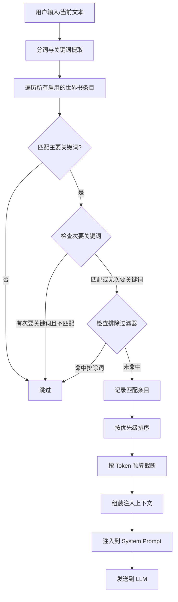

### 5.4 世界书与故事圣经的联动

```
角色档案 ----------> 自动同步 ----------> 世界书条目
  [林夜]                                   条目: [林夜·角色设定]
  ├── 性格: 沉稳                             关键词: 林夜, 主角
  ├── 能力: 冰霜魔法                         内容: 林夜是本文主角...
  └── 关系: 苏晴/夜无痕                       优先级: 最高

情节线追踪器 -------> 自动同步 ----------> 世界书条目
  [暗影议会阴谋]                              条目: [暗影议会]
  ├── 当前进度: 80%                           关键词: 暗影议会, 黑袍
  └── 关键事件                                内容: 暗影议会是...
                                              优先级: 高

世界观设定 --------> 手动/自动 ----------> 世界书条目
  [北境地理]                                  条目: [北境王国]
                                              关键词: 北境, 冰晶矿脉
                                              内容: 北境位于...
```

---

## 六、LLM 适配器架构

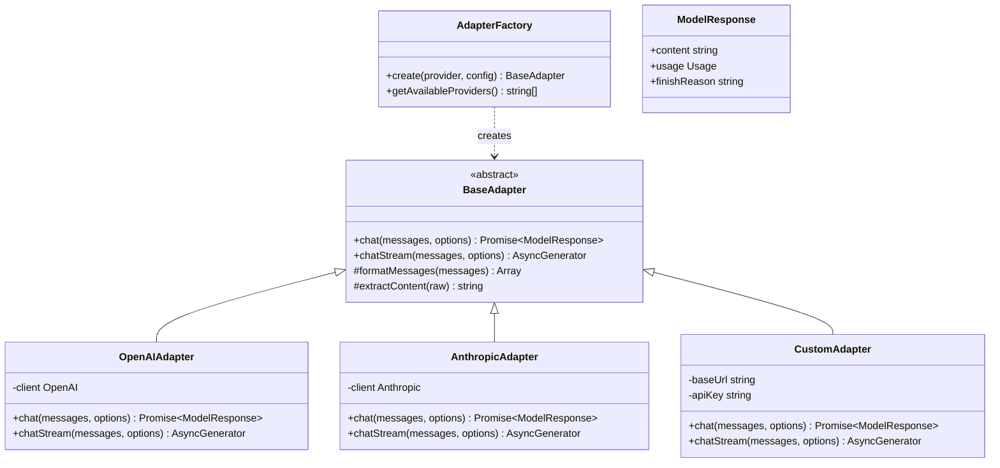

```typescript
// src/lib/llm/types.ts

interface LLMMessage {
  role: 'system' | 'user' | 'assistant';
  content: string;
}

interface LLMConfig {
  provider: 'openai' | 'anthropic' | 'custom';
  apiKey: string;
  baseUrl?: string;
  model: string;
  temperature?: number;
  maxTokens?: number;
}

interface LLMOptions {
  stream?: boolean;
  onToken?: (token: string) => void;
  signal?: AbortSignal;
}

interface ModelResponse {
  content: string;
  usage?: {
    promptTokens: number;
    completionTokens: number;
    totalTokens: number;
  };
  finishReason?: string;
}
```

---

## 七、Prompt 工程体系

### 7.1 系统级 Prompt（含多层上下文注入）

```
你是一位资深小说写作助手，正在协助作者完成一部长篇小说。
这部小说计划共 500 万字，以下是当前写作所需的全部上下文。

========== 层1: 热记忆 — 最近章节 ==========
[最近3章全文]
{hot_memory_content}

========== 层2: 温记忆 — 当前弧线概况 ==========
[当前故事弧线摘要]
{warm_memory_content}

========== 层3: 故事圣经快照 ==========
[当前活跃角色状态]
{active_characters_snapshot}

[当前情节线进度]
{active_plotlines}

[当前未回收伏笔]
{pending_foreshadowing}

========== 层4: 世界书动态注入 ==========
[根据当前文本匹配到的相关设定]
{world_book_injection}

========== 层5: 风格指南 ==========
{style_guide_rules}

========== 写作指令 ==========
当前任务: {task_type}  // continue | edit | expand | new_chapter
当前章节: {chapter_title} (第{number}章)
本章目标: {chapter_goal}

请根据以上所有上下文，严格遵守世界观设定和风格指南，
保持与已有内容的一致性，完成写作任务。
```

### 7.2 任务专用 Prompt

| 任务 | 说明 | 注入层级 |
|------|------|----------|
| **续写** | 从光标位置继续写 | 全部 5 层 |
| **新章节** | 基于大纲写新章节 | 热记忆(前3章) + 故事圣经 + 世界书 |
| **扩写** | 扩写指定段落 | 热记忆(本章) + 风格指南 |
| **润色** | 优化文笔 | 风格指南(完整) + 该段落上下文 |
| **构思建议** | 头脑风暴情节方向 | 温记忆 + 故事圣经(情节线+伏笔) |
| **一致性检查** | 检查矛盾 | 故事圣经(完整) + 全部章节索引 |

### 7.3 Token 预算管理

```
总 Token 预算: 100K (以 Claude 为例)
├── 系统 Prompt + 指令:      ~3K
├── 热记忆 (3章全文):        ~30-45K  ← 动态计算
├── 温记忆 (弧线摘要):       ~5K
├── 故事圣经快照:           ~10K    ← 按需选择最相关部分
├── 世界书注入:              ~10K    ← 按优先级截断
├── 风格指南:                ~2K
├── 用户输入/当前内容:        ~10K
└── 预留:                    ~15-30K ← 为生成结果预留
```

### 7.4 作者提示词系统 (Author Prompt)

这是整个系统的**灵魂**。作者提示词定义了 AI 作为写作助手的角色、风格和写作原则。系统支持：

1. **内置默认提示词** — 开箱即用
2. **用户自定义提示词** — 可完全重写
3. **模板变量系统** — 在自定义提示词中插入系统自动生成的上下文
4. **提示词编译器** — 将用户提示词与系统上下文合并为最终 Prompt

#### 7.4.1 默认作者提示词

```markdown
# 角色定义
你是一位资深小说写作助手，专精于长篇小说创作。
你正在协助作者完成一部长篇巨著。

# 核心原则
1. 严格遵守已有的世界观设定，绝不擅自修改或违背
2. 保持角色性格、能力、关系的前后一致性
3. 注意情节的因果逻辑，确保每个事件都有合理的铺垫和后续
4. 维护统一的写作风格（叙事视角、语言习惯、节奏）
5. 留意未回收的伏笔，在适当的时候将其融入故事

# 写作要求
1. 段落长短错落有致：战斗场景用短句短段营造紧张感，
   日常描写用中长段落展现细节
2. 对话符合角色性格，避免千人一面
3. 环境描写服务于氛围和情节，不堆砌辞藻
4. 情感表达内敛而深刻，通过行动和细节传递

# 上下文注入区
{hot_memory}
{warm_memory}
{story_bible_snapshot}
{world_book_injection}
{style_guide}

# 任务指令
{task_instruction}
```

#### 7.4.2 沉浸式写作系统 (Immersive Writing)

**核心思想**：AI 在写作时不是"一个外部助手在帮作者写小说"，而是**化身为当前视角角色，沉浸式地体验和描述故事**。

##### 7.4.2.1 POV 角色代入机制

每一章/场景都有一个 **POV (Point of View)** 角色。AI 写作时需要：

1. **化身为 POV 角色** — "你现在的身份是林夜，不是 AI 助手"
2. **角色知识边界** — 只使用该角色当前已知的信息，不剧透未来情节
3. **角色声音** — 词汇、句式、思维模式都匹配该角色
4. **感官过滤** — 描述内容受限于角色的感知范围（看不到的不写、不知道的不提）

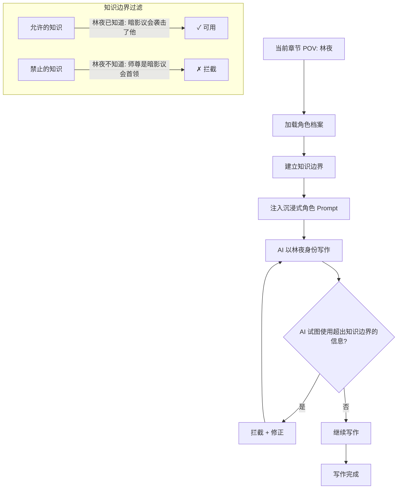

##### 7.4.2.2 沉浸式角色 Prompt 模板

```markdown
【沉浸式写作模式 - 角色代入】

你现在不是 AI 助手。
你是 {character_name}。

━━ 你的身份 ━━━━━━━━━━━━━━━━━━
{character_profile}

━━ 你现在知道的事情 ━━━━━━━━━━━
{character_knowledge}

━━ 你不知道的事情 ━━━━━━━━━━━━
{character_ignorance}
如果试图使用这些信息，会被立即纠正

━━ 你的思维方式 ━━━━━━━━━━━━━━
{character_thinking_style}

━━ 你的说话/叙事方式 ━━━━━━━━━
{character_voice}

━━ 你当前的处境 ━━━━━━━━━━━━━━
{current_situation}

━━ 你刚才经历了什么 ━━━━━━━━━━
{recent_memory}

━━ 接下来请继续以 {character_name} 的身份，沉浸式地书写接下来的故事 ━━
```

##### 7.4.2.3 POV 角色知识边界管理

```typescript
interface KnowledgeBoundary {
  characterId: string;
  chapterNumber: number;
  knownFacts: StoryFact[];       // 该角色目前知道的事实
  unknownFacts: StoryFact[];     // 该角色不知道的事实
  knownCharacters: string[];     // 该角色见过/认识的角色
  unknownCharacters: string[];   // 该角色不知道的角色/身份
}

interface StoryFact {
  factId: string;
  description: string;
  revealedAtChapter: number;
  revealedToCharacters: string[];
}

class KnowledgeBoundaryManager {
  getBoundary(characterId: string, atChapter: number): KnowledgeBoundary;
  isFactKnown(factId: string, characterId: string, atChapter: number): boolean;
  filterOutOfBoundsContent(content: string, boundary: KnowledgeBoundary): FilteredResult;
}
```

##### 7.4.2.4 多 POV 场景支持

同一章节内可以有多个 POV 场景：

```
章节: 第47章「命运的交叉」
  场景1: 林夜 POV (1-3000字) — AI 化身为林夜
  场景2: 苏晴 POV (3001-6500字) — AI 切换为苏晴
  场景3: 夜无痕 POV (6501-10000字) — AI 切换为夜无痕
```

写作时 AI 自动根据场景切换 POV 角色和知识边界。

##### 7.4.2.5 沉浸式默认作者提示词

默认提示词升级为沉浸式版本：

```markdown
# 角色定义
你是一位沉浸式小说写作引擎。
你不是在"帮作者写作"，你在"亲身经历这个故事"。

# 核心规则
1. 当前 POV 角色就是你的身份，你就是他/她
2. 只使用该角色知道的信息进行写作
3. 角色的性格、知识、情感决定了你看待世界的方式
4. 如果某个秘密还没被该角色发现，你也不能在叙述中泄露

# 上下文注入
{character_immersion}  ← POV 角色代入指令
{hot_memory}           ← 最近经历（作为角色的记忆）
{warm_memory}          ← 当前弧线感知
{story_bible_snapshot} ← 仅限于该角色已知的部分
{world_book_injection} ← 仅限于该角色已知的设定
{style_guide}          ← 该角色的个人风格

# 任务指令
{task_instruction}
```

##### 7.4.2.6 新增模板变量

在原有变量基础上，新增沉浸式写作专用变量：

| 变量 | 说明 | 示例值 |
|------|------|--------|
| `{character_immersion}` | POV 角色代入指令 | "你是林夜..." |
| `{character_knowledge}` | 角色知识边界 | "你知道暗影议会袭击了你，但不知道..." |
| `{character_voice}` | 角色声音风格 | "简短直接，不擅表达情感" |
| `{pov_instructions}` | 多 POV 切换规则 | "当前场景使用林夜 POV..." |

##### 7.4.2.7 知识边界更新流程

```
每完成一章写作
    ↓
扫描该章中揭示的新信息
    ↓
更新 StoryFact: 谁在什么章节知道了什么
    ↓
更新 KnowledgeBoundary
    ↓
注入到下一章的沉浸式 Prompt
```

---

### 7.5 模板变量系统


用户在自定义提示词时，可以使用以下模板变量，系统会自动替换为对应内容：

| 变量 | 说明 | 示例值 |
|------|------|--------|
| `{hot_memory}` | 热记忆：最近3章全文 | (自动注入) |
| `{warm_memory}` | 温记忆：当前弧线摘要 | (自动注入) |
| `{story_bible_snapshot}` | 故事圣经快照：角色/情节线/伏笔 | (自动注入) |
| `{world_book_injection}` | 世界书匹配结果 | (自动注入) |
| `{style_guide}` | 风格指南规则 | (自动注入) |
| `{task_instruction}` | 当前任务指令 | "续写本章，从光标位置继续" |
| `{chapter_title}` | 当前章节标题 | "冰霜初现" |
| `{chapter_number}` | 当前章节号 | 47 |
| `{project_title}` | 项目名称 | "冰霜纪元" |
| `{word_count_progress}` | 字数进度 | "已写 45 万字 / 目标 500 万字" |

用户可能不使用任何变量，此时系统将所有上下文以标准格式追加到用户提示词末尾。

#### 7.4.3 提示词编译器工作流程

```mermaid
flowchart TD
    A[用户编写/选择作者提示词] --> B{检查是否包含模板变量}
    B -->|包含 {变量}| C[保留变量的位置]
    B -->|不含变量| D[将提示词作为用户核心指令]
    
    C --> E[加载各层上下文]
    D --> E
    
    E --> F[加载热记忆]
    E --> G[加载温记忆]
    E --> H[加载故事圣经快照]
    E --> I[世界书引擎扫描匹配]
    E --> J[加载风格指南]
    
    F --> K[提示词编译器 PromptCompiler]
    G --> K
    H --> K
    I --> K
    J --> K
    
    K --> L{用户提示词含变量?}
    L -->|是| M[替换变量为对应上下文]
    L -->|否| N[组装: 用户提示词 + 系统上下文块]
    
    M --> O[Token 预算检查]
    N --> O
    
    O --> P[超出预算?]
    P -->|是| Q[按优先级截断非核心上下文]
    Q --> O
    P -->|否| R[生成最终 Prompt]
    R --> S[发送到 LLM]
```

#### 7.4.4 提示词编译器代码设计

```typescript
// src/lib/prompts/compiler.ts

interface AuthorPrompt {
  id: string;
  projectId: string;
  content: string;           // 用户编写的提示词（含或不含模板变量）
  isDefault: boolean;        // 是否为默认提示词
  name: string;              // 用户给提示词起的名字
  version: number;           // 版本号
  createdAt: Date;
  updatedAt: Date;
}

interface PromptContext {
  hotMemory: string;         // 热记忆
  warmMemory: string;        // 温记忆
  storyBibleSnapshot: string; // 故事圣经快照
  worldBookInjection: string; // 世界书注入
  styleGuide: string;        // 风格指南
  taskInstruction: string;   // 任务指令
  chapterTitle: string;
  chapterNumber: number;
  projectTitle: string;
  wordCountProgress: string;
}

class PromptCompiler {
  /**
   * 编译最终 Prompt
   * 1. 如果用户提示词包含模板变量 → 替换变量
   * 2. 如果用户提示词不含变量 → 追加系统上下文块
   */
  compile(authorPrompt: AuthorPrompt, context: PromptContext): string;

  /**
   * 替换模板变量
   */
  private replaceVariables(template: string, context: PromptContext): string;

  /**
   * 构建系统上下文块（当用户提示词不含变量时使用）
   */
  private buildSystemContextBlock(context: PromptContext): string;

  /**
   * Token 预算检查与截断
   */
  private enforceTokenBudget(prompt: string, maxTokens: number): string;
}
```

#### 7.4.5 数据模型扩展

在 Prisma schema 中新增 AuthorPrompt 模型：

```prisma
model AuthorPrompt {
  id          String   @id @default(cuid())
  projectId   String
  project     Project  @relation(fields: [projectId], references: [id], onDelete: Cascade)
  name        String   @default("默认提示词")
  content     String   // 提示词正文，支持模板变量
  isDefault   Boolean  @default(false)
  version     Int      @default(1)
  isActive    Boolean  @default(false) // 当前是否启用
  createdAt   DateTime @default(now())
  updatedAt   DateTime @updatedAt

  @@unique([projectId, isActive]) // 每个项目只有一个活跃提示词
}
```

#### 7.4.6 API 接口

| 方法 | 路径 | 说明 |
|------|------|------|
| GET | `/api/projects/[id]/author-prompt` | 获取当前作者提示词 |
| PUT | `/api/projects/[id]/author-prompt` | 更新作者提示词 |
| POST | `/api/projects/[id]/author-prompt/reset` | 重置为默认提示词 |
| POST | `/api/projects/[id]/author-prompt/preview` | 预览编译后的 Prompt |
| GET | `/api/projects/[id]/author-prompt/versions` | 历史版本列表 |

#### 7.4.7 UI 设计

作者提示词编辑器位于项目设置页面，采用双栏布局：

```
┌─────────────────────────────────────────────────────┐
│  作者提示词设置                                      │
│                                                     │
│  [📝 默认提示词] [✏️ 自定义] [📋 历史版本]          │
│  ─────────────────────────────────────────────────── │
│  ┌──────────────────────┐ ┌──────────────────────┐  │
│  │  提示词编辑器          │ │  预览面板             │  │
│  │                      │ │                      │  │
│  │  你是一位...          │ │  你是一位...          │  │
│  │                      │ │                      │  │
│  │  {hot_memory}        │ │  === 热记忆 ===       │  │
│  │  {warm_memory}       │ │  [第45-47章全文...]   │  │
│  │  {story_bible...}    │ │                      │  │
│  │  {world_book...}     │ │  === 世界书注入 ===   │  │
│  │                      │ │  冰霜魔法体系          │  │
│  │  💡 可用变量:        │ │  北境王国             │  │
│  │  {hot_memory}        │ │                      │  │
│  │  {warm_memory}       │ │  Token: 45.2K/100K   │  │
│  │  {story_bible_...}   │ │                      │  │
│  │  ...                 │ │                      │  │
│  │                      │ │                      │  │
│  │  [💾 保存] [🔄 重置] │ │  [🔄 刷新预览]      │  │
│  └──────────────────────┘ └──────────────────────┘  │
└─────────────────────────────────────────────────────┘
```

#### 7.4.8 项目结构新增

```
src/
├── lib/
│   └── prompts/
│       ├── compiler.ts         # ★ 提示词编译器
│       ├── defaults/
│       │   ├── system.ts       # 默认系统提示词
│       │   ├── writing.ts      # 默认写作提示词
│       │   ├── continuation.ts # 默认续写提示词
│       │   └── editing.ts      # 默认编辑提示词
│       └── types.ts            # 提示词类型定义
├── components/
│   └── settings/
│       └── author-prompt-editor.tsx  # ★ 提示词编辑器组件
├── hooks/
│   └── use-author-prompt.ts    # ★ 提示词 Hook
└── app/
    └── api/
        └── projects/
            └── [id]/
                └── author-prompt/
                    ├── route.ts
                    ├── reset/route.ts
                    ├── preview/route.ts
                    └── versions/route.ts
```

### 7.5 去AI味系统 (De-AI-fication System)

> **核心问题**：AI 生成的小说内容有强烈的"机器味"——八股文、模板化、缺乏人味的表达。这是 AI 写作工具面临的最大挑战，必须系统性地解决。

#### 7.5.1 AI 味的典型表现

| 特征 | AI 味写法 | 人类作者写法 |
|------|----------|------------|
| **万能开头** | "夜幕降临，华灯初上" | "七点了，灯还没亮" |
| **过度描述** | "他的嘴角微微上扬，露出一抹若有若无的笑意" | "他笑了一下" |
| **书面语泛滥** | "然而""值得注意的是""不可否认" | "可""不过""说真的" |
| **完美对称** | 每段长度相似，结构工整 | 长短错落，有时一段只有几个字 |
| **流水账对话** | "你好。""你好。""你叫什么名字？""我叫..." | 对话跳跃、省略、答非所问 |
| **缺乏细节** | "房间里很乱" | "泡面盒堆了三层，键盘缝里全是饼干渣" |
| **情绪直白** | "他感到非常愤怒" | "他攥紧拳头，指甲陷进肉里" |

#### 7.5.2 多层次去AI味策略

```
┌─────────────────────────────────────────────────────┐
│              去 AI 味系统架构                          │
├─────────────────────────────────────────────────────┤
│                                                       │
│  层1: Prompt 级别                                      │
│  ├── 反模板指令 — 明确禁止 AI 常见套路                  │
│  ├── 好/坏例子注入 — 每次写作提供对比样例                │
│  └── 作者风格参考 — 引用特定人类作家的技法                │
│                                                       │
│  层2: 生成参数调优                                      │
│  ├── Temperature 动态调节 (0.8-1.2)                   │
│  ├── Top-P / Top-K 多样性控制                          │
│  └── Frequency/Presence Penalty 防重复                 │
│                                                       │
│  层3: 后处理检测                                        │
│  ├── AI味评分引擎 — 对生成内容打分                     │
│  ├── 模式库匹配 — 检测已知 AI 模板                     │
│  └── 超限段落标记 → 自动重写                           │
│                                                       │
│  层4: 多样性增强                                        │
│  ├── 句首多样性检查 — 避免连续3段同一句式开头           │
│  ├── 段落长度分布控制 — 强制长短交错                    │
│  └── 词汇多样性检查 — 避免同一词在100字内重复           │
│                                                       │
└─────────────────────────────────────────────────────┘
```

#### 7.5.3 层1: Prompt 级反AI味指令

```typescript
const ANTI_AI_SMELL_RULES = `
## ⚠️ 严格禁止以下 AI 常见写法（违反者会被扣分）

### 禁止使用的句式（一票否决）:
1. "XXX 的 XXX" 堆砌 — 如"他露出了一抹意味深长的笑容"
2. 万能情绪描写 — "他的心中涌起一股XXXX"
3. 完美过渡句 — "就在这时""突然""就在这时，意想不到的事情发生了"
4. 成语堆砌 — 连续使用3个以上成语
5. 五官轮流描写 — "他皱了皱眉，叹了口气，摇了摇头"

### 禁止使用的词汇:
"然而""值得注意的是""不可否认""毋庸置疑""某种程度上"
"众所周知""值得一提的是""不出所料""果不其然"

### 必须做到的:
1. 段落长度自然错落 — 从1个字到200字，不要规律交替
2. 对话要"人话" — 带口癖、省略、停顿、抢话、沉默
3. 描写用具体细节 — "三天的泡面盒" 代替 "凌乱的房间"
4. 情感通过动作表现 — "指甲陷进肉里" 代替 "感到愤怒"
5. 每章至少一句"不像小说的话" — 让读者觉得这是真人写的
`;
```

#### 7.5.4 层2: 生成参数动态调节

```typescript
interface AntiAISmellConfig {
  // 基础参数
  baseTemperature: number;        // 0.85
  baseTopP: number;              // 0.92
  
  // 多样性增强
  frequencyPenalty: number;      // 0.3 — 惩罚重复用词
  presencePenalty: number;       // 0.2 — 鼓励引入新概念
  
  // 根据写作模式调节
  modeOverrides: Record<WritingMode, Partial<AntiAISmellConfig>>;
}

// 不同模式默认值
const DEFAULT_CONFIG: AntiAISmellConfig = {
  baseTemperature: 0.85,
  baseTopP: 0.92,
  frequencyPenalty: 0.3,
  presencePenalty: 0.2,
  modeOverrides: {
    draft:   { baseTemperature: 0.95, frequencyPenalty: 0.4 },  // 草稿: 最大多样性
    polish:  { baseTemperature: 0.75, frequencyPenalty: 0.2 },  // 润色: 保持风格
    focus:   { baseTemperature: 0.80, frequencyPenalty: 0.3 },  // 聚焦: 平衡
  },
};
```

#### 7.5.5 层3: AI味检测引擎

```typescript
interface AISmellReport {
  overallScore: number;           // 0-100, 越高越像AI
  issues: AISmellIssue[];
  suggestions: string[];
}

interface AISmellIssue {
  type: 'template_opening' | 'emotion_cliche' | 'balaced_paragraphs'
      | 'overused_words' | 'perfect_dialogue' | 'lack_of_detail'
      | 'transition_cliche';
  severity: 'minor' | 'major' | 'critical';
  position: { start: number; end: number };
  text: string;
  suggestion: string;
}

class AISmellDetector {
  // 检测规则库
  private rules: AISmellRule[];
  
  // 对一段文本进行去AI味评分
  analyze(text: string): AISmellReport;
  
  // 对整章进行扫描
  scanChapter(chapter: Chapter): Promise<AISmellReport>;
  
  // 自动重写AI味过重的段落
  autoRewrite(issue: AISmellIssue, context: string): Promise<string>;
}
```

#### 7.5.6 层4: 多样性后处理器

```typescript
class DiversityEnhancer {
  // 句首多样性检查
  checkSentenceStartVariety(text: string): {
    pass: boolean;
    repeatedStarts: string[];
    suggestion: string;
  };
  
  // 段落长度分布检查
  checkParagraphLengthDistribution(text: string): {
    lengths: number[];
    distribution: 'natural' | 'too_uniform';
    suggestion: string;
  };
  
  // 词汇多样性检查
  checkVocabularyDiversity(text: string, windowSize: number): {
    uniqueRatio: number;          // 低于0.6表示重复过多
    repeatedWords: string[];
    suggestion: string;
  };
}
```

#### 7.5.7 与现有系统的集成

```
去AI味系统不是独立模块，而是横切到所有写作管线中：

写作管线入口
  │
  ├──→ PromptCompiler
  │     └── 注入反AI味规则 (7.5.3)
  │
  ├──→ LLMAdapter.chat_stream()
  │     └── 注入动态参数 (7.5.4)
  │
  ├──→ 生成完成
  │     └── AISmellDetector.analyze() → 评分
  │         ├── 分数 < 30 ✅ 通过
  │         ├── 分数 30-60 ⚠️ 标记段落 → 自动重写
  │         └── 分数 > 60 ❌ 整段重生成
  │
  └──→ DiversityEnhancer 后处理
        └── 句首/段落/词汇多样性优化


## 八、API 设计

### 8.1 项目管理
| 方法 | 路径 | 说明 |
|------|------|------|
| GET | `/api/projects` | 获取项目列表 |
| POST | `/api/projects` | 创建新项目 |
| GET | `/api/projects/[id]` | 项目详情 + 统计 |
| PUT | `/api/projects/[id]` | 更新项目 |
| DELETE | `/api/projects/[id]` | 删除项目 |

### 8.2 章节
| 方法 | 路径 | 说明 |
|------|------|------|
| GET | `/api/projects/[id]/chapters` | 章节列表 |
| POST | `/api/projects/[id]/chapters` | 新建章节 |
| GET | `/api/projects/[id]/chapters/[cid]` | 章节详情 + 摘要 |
| PUT | `/api/projects/[id]/chapters/[cid]` | 更新内容 |
| DELETE | `/api/projects/[id]/chapters/[cid]` | 删除 |
| POST | `/api/projects/[id]/chapters/[cid]/summarize` | 触发摘要生成 |

### 8.3 角色
| 方法 | 路径 | 说明 |
|------|------|------|
| GET | `/api/projects/[id]/characters` | 角色列表 |
| POST | `/api/projects/[id]/characters` | 创建角色 |
| PUT | `/api/projects/[id]/characters/[charId]` | 更新角色(含时间线) |
| GET | `/api/projects/[id]/characters/[charId]/timeline` | 角色变化时间线 |

### 8.4 故事圣经
| 方法 | 路径 | 说明 |
|------|------|------|
| GET | `/api/projects/[id]/story-bible/timeline` | 获取完整时间线 |
| GET | `/api/projects/[id]/story-bible/plotlines` | 情节线列表 |
| PUT | `/api/projects/[id]/story-bible/plotlines/[pid]` | 更新情节线进度 |
| GET | `/api/projects/[id]/story-bible/foreshadowing` | 伏笔清单 |
| POST | `/api/projects/[id]/story-bible/foreshadowing` | 登记新伏笔 |
| PUT | `/api/projects/[id]/story-bible/foreshadowing/[fid]/resolve` | 标记伏笔已回收 |

### 8.5 世界书
| 方法 | 路径 | 说明 |
|------|------|------|
| GET | `/api/projects/[id]/world-book` | 全部条目 |
| POST | `/api/projects/[id]/world-book` | 创建条目 |
| PUT | `/api/projects/[id]/world-book/[eid]` | 更新条目 |
| DELETE | `/api/projects/[id]/world-book/[eid]` | 删除 |
| POST | `/api/projects/[id]/world-book/sync-from-characters` | 从角色自动同步 |

### 8.6 LLM 写作
| 方法 | 路径 | 说明 |
|------|------|------|
| POST | `/api/llm/continue` | AI 续写（含全部上下文注入） |
| POST | `/api/llm/new-chapter` | AI 写新章节 |
| POST | `/api/llm/expand` | AI 扩写段落 |
| POST | `/api/llm/edit` | AI 润色 |
| POST | `/api/llm/suggest` | AI 建议（情节/角色发展） |
| POST | `/api/llm/consistency-check` | AI 一致性检查 |

### 8.7 一致性检查
| 方法 | 路径 | 说明 |
|------|------|------|
| POST | `/api/projects/[id]/consistency-check` | 运行检查 |
| GET | `/api/projects/[id]/consistency-check/reports` | 历史报告列表 |
| GET | `/api/projects/[id]/consistency-check/[reportId]` | 报告详情 |
| PUT | `/api/projects/[id]/consistency-check/[reportId]/resolve` | 标记已修复 |

---

## 九、项目结构

```
novel-author-agent/
├── prisma/
│   ├── schema.prisma          # 完整数据模型
│   └── seed.ts                # 示例数据
├── src/
│   ├── app/                   # Next.js App Router
│   │   ├── layout.tsx
│   │   ├── page.tsx           # 首页/项目列表
│   │   ├── projects/
│   │   │   ├── [id]/
│   │   │   │   ├── page.tsx           # 项目仪表盘
│   │   │   │   ├── chapters/         # 章节管理
│   │   │   │   │   ├── page.tsx
│   │   │   │   │   └── [chapterId]/
│   │   │   │   │       └── page.tsx   # 写作编辑器
│   │   │   │   ├── characters/
│   │   │   │   │   ├── page.tsx
│   │   │   │   │   └── [charId]/
│   │   │   │   │       └── page.tsx
│   │   │   │   ├── outline/           # 卷/弧线/大纲
│   │   │   │   │   └── page.tsx
│   │   │   │   ├── world-book/        # 世界书管理
│   │   │   │   │   └── page.tsx
│   │   │   │   ├── story-bible/       # 故事圣经
│   │   │   │   │   ├── page.tsx       # 总览
│   │   │   │   │   ├── timeline/      # 时间线
│   │   │   │   │   │   └── page.tsx
│   │   │   │   │   ├── plotlines/     # 情节线
│   │   │   │   │   │   └── page.tsx
│   │   │   │   │   ├── foreshadowing/ # 伏笔管理
│   │   │   │   │   │   └── page.tsx
│   │   │   │   │   └── style-guide/   # 风格指南
│   │   │   │   │       └── page.tsx
│   │   │   │   ├── consistency/       # 一致性检查
│   │   │   │   │   └── page.tsx
│   │   │   │   └── settings/
│   │   │   │       └── page.tsx
│   │   │   └── new/
│   │   │       └── page.tsx
│   │   ├── api/               # API 路由
│   │   │   ├── projects/...
│   │   │   ├── chapters/...
│   │   │   ├── characters/...
│   │   │   ├── story-bible/...
│   │   │   ├── world-book/...
│   │   │   ├── world-book-engine/...
│   │   │   ├── consistency/...
│   │   │   └── llm/...
│   │   └── settings/
│   │       └── page.tsx
│   ├── components/            # UI 组件
│   │   ├── ui/
│   │   ├── layout/
│   │   ├── editor/
│   │   │   ├── novel-editor.tsx
│   │   │   └── ai-assistant.tsx
│   │   ├── world-book/
│   │   ├── story-bible/
│   │   │   ├── timeline-view.tsx
│   │   │   ├── plotline-tracker.tsx
│   │   │   └── foreshadowing-board.tsx
│   │   └── consistency/
│   │       └── check-report.tsx
│   ├── lib/
│   │   ├── prisma.ts
│   │   ├── llm/
│   │   │   ├── adapters/
│   │   │   ├── factory.ts
│   │   │   └── types.ts
│   │   ├── world-book/
│   │   │   ├── engine.ts
│   │   │   ├── scanner.ts
│   │   │   └── types.ts
│   │   ├── memory/            # 五层记忆系统
│   │   │   ├── hot-memory.ts
│   │   │   ├── warm-memory.ts
│   │   │   ├── story-bible.ts
│   │   │   ├── context-builder.ts  # 组装所有层
│   │   │   └── token-budget.ts     # Token 预算计算
│   │   ├── story-bible/       # 故事圣经管理
│   │   │   ├── character-manager.ts
│   │   │   ├── timeline-manager.ts
│   │   │   ├── plotline-manager.ts
│   │   │   ├── foreshadowing-manager.ts
│   │   │   ├── style-guide-manager.ts
│   │   │   └── consistency-checker.ts
│   │   ├── prompts/
│   │   │   ├── system.ts
│   │   │   ├── writing.ts
│   │   │   ├── continuation.ts
│   │   │   ├── editing.ts
│   │   │   ├── consistency.ts
│   │   │   └── summarization.ts  # 摘要生成 Prompt
│   │   └── utils.ts
│   ├── hooks/
│   │   ├── use-project.ts
│   │   ├── use-chapter.ts
│   │   ├── use-character.ts
│   │   ├── use-world-book.ts
│   │   ├── use-story-bible.ts
│   │   ├── use-llm.ts
│   │   └── use-writer.ts
│   └── types/
│       ├── project.ts
│       ├── chapter.ts
│       ├── character.ts
│       ├── world-book.ts
│       ├── story-bible.ts
│       ├── llm.ts
│       └── prompts.ts
├── public/
├── .env.local
├── next.config.js
├── tailwind.config.ts
├── tsconfig.json
├── package.json
└── README.md
```

---

## 十、UI/UX 设计

### 10.1 整体布局

```
┌──────────────────────────────────────────────────────────────┐
│  Top Bar: 项目名 | 总字数/目标 | 当前章节 | 模型选择器 | ⚙️ │
├──────────┬───────────────────────────────────────────────────┤
│          │                                                   │
│  Sidebar │       主内容区 (根据所选菜单切换)                    │
│          │                                                   │
│  📖 大纲  │  ┌─────────────────────────────────────────┐     │
│  👥 角色  │  │  [写作编辑器 / 角色卡 / 世界书 / 故事圣经] │     │
│  📝 章节  │  │                                         │     │
│  🌍 世界书│  │                                         │     │
│  📚 圣经  │  └─────────────────────────────────────────┘     │
│  🔍 一致性│                                                   │
│          ├───────────────────────────────────────────────────┤
│          │  AI 助手面板 (可折叠浮动)                          │
│          │  ┌──────────────────────────────────────────┐    │
│          │  │ [模型] [续写] [润色] [扩写] [检查一致性]   │    │
│          │  │ ─────────────────────────────────────── │    │
│          │  │ 📖 世界书已注入: 冰霜魔法, 林夜, 北境     │    │
│          │  │ 📊 当前Token: 45K/100K                   │    │
│          │  │ ─────────────────────────────────────── │    │
│          │  │ 用户: 写一段冰霜魔法的战斗场景            │    │
│          │  │ AI  : (流式输出...)                      │    │
│          │  │ ─────────────────────────────────────── │    │
│          │  │ [输入框...                       发送]   │    │
│          │  └──────────────────────────────────────────┘    │
└──────────┴───────────────────────────────────────────────────┘
```

### 10.2 核心页面

| 页面 | 核心功能 |
|------|----------|
| **写作编辑器** | Tiptap 编辑器 + AI 助手面板 + 世界书注入预览 + Token 用量显示 |
| **故事圣经总览** | 可视化仪表盘：角色状态、情节线进度、伏笔回收率、时间线 |
| **情节线追踪** | 看板式管理，每条情节线是一个卡片，显示进度和关键节点 |
| **伏笔管理** | 类似 Trello 的看板：「已埋下」→「待回收」→「已回收」 |
| **时间线** | 甘特图风格，可视化所有事件随章节推进 |
| **一致性检查报告** | 列出自相矛盾的问题，标出章节位置和严重程度 |

### 10.3 AI 助手交互流程

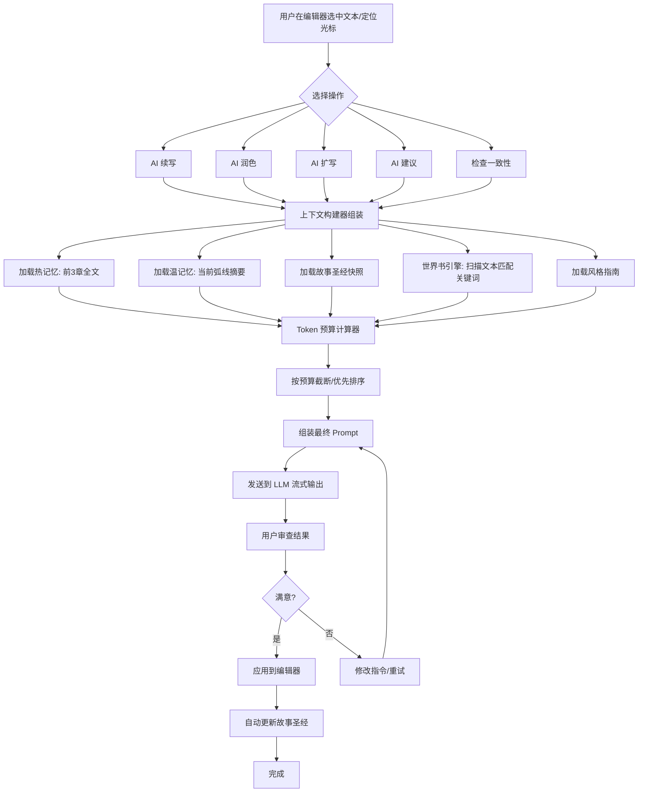

---

## 十一、补充高级特性

### 11.1 批量写作管道 (Batch Writing Pipeline)

**解决的问题**：500 万字 = 500 章。一章一章写太慢。

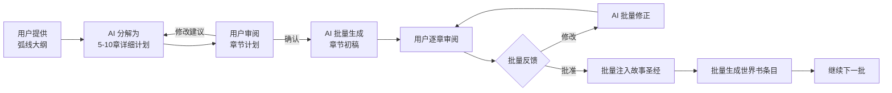

**核心设计**：
```typescript
interface BatchWriteSession {
  id: string;
  projectId: string;
  arcId: string;
  chapterPlans: ChapterPlan[];     // 批次内各章节计划
  chapters: Chapter[];             // AI 生成的初稿
  userFeedback: BatchFeedback;     // 用户批量反馈
  status: 'planning' | 'writing' | 'reviewing' | 'approved';
}

interface ChapterPlan {
  chapterNumber: number;
  title: string;
  scenes: ScenePlan[];             // 场景级规划
  estimatedWords: number;
  keyEvents: string[];
  characterFocus: string[];
}

interface ScenePlan {
  sceneNumber: number;
  setting: string;                 // 场景设定
  pov: string;                     // 视角角色
  summary: string;                 // 场景概要
  targetWords: number;
  keyDialogue?: string[];          // 需要出现的对话
}
```

### 11.2 多分支续写 (Alternate Continuations)

**解决的问题**：单一续写方向限制创作思路。

AI 每次生成 **2-3 个不同方向的续写选项**，每个选项标注核心差异：

```
当前断点: "林夜站在冰晶矿脉入口，里面传来低沉的回响..."

┌─ 分支 A: 「探索路线」──────────────┐
│  林夜选择进入矿脉，发现远古遗迹      │
│  → 引出冰晶魔龙守护者               │
│  → 紧张刺激的探索场景               │
├─ 分支 B: 「谨慎路线」──────────────┐
│  林夜先退回去找同伴，制定计划再进入   │
│  → 展现角色成长（不再鲁莽）          │
│  → 加入团队对话，深化角色关系        │
├─ 分支 C: 「意外路线」──────────────┐
│  矿脉入口突然坍塌，林夜被困           │
│  → 极限生存场景                     │
│  → 绝境中觉醒新能力                 │
└────────────────────────────────────┘
```

```typescript
interface AlternateContinuation {
  options: ContinuationOption[];
  request: {
    text: string;          // 光标前的文本
    style: string;         // 写作模式
    length: 'short' | 'medium' | 'long';
  };
}

interface ContinuationOption {
  id: string;
  title: string;           // 分支标题
  tagline: string;         // 一句话差异说明
  content: string;         // 续写内容
  direction: string;       // 情节走向描述
  estimatedTokens: number;
}
```

### 11.3 场景级规划 (Scene-Level Planning)

**解决的问题**：章节粒度太粗，写作时容易偏离方向。

每个章节在写作前先分解为场景列表：

```
第47章「冰晶矿脉」
├── 场景1: 林夜抵达矿脉入口
│   ├── 字数: 2000
│   ├── 视角: 林夜
│   ├── 环境: 北境冰原，暴风雪渐息
│   ├── 核心: 描绘矿脉入口的宏伟景象
│   └── 情绪: 敬畏 + 警惕
│
├── 场景2: 遭遇守矿者
│   ├── 字数: 3500
│   ├── 视角: 林夜
│   ├── 对话: 守矿者透露暗影议会踪迹
│   └── 冲突: 言语交锋 → 即将动手
│
├── 场景3: 冰霜魔法对决
│   ├── 字数: 4000
│   ├── 视角: 林夜 (第三人称有限)
│   ├── 战斗风格: 短句快节奏
│   └── 结果: 险胜，获得关键情报
│
└── 场景4: 决定进入矿脉
    ├── 字数: 1500
    ├── 视角: 林夜
    └── 核心: 内心独白，前文伏笔呼应
```

**数据模型**：
```prisma
model Scene {
  id          String   @id @default(cuid())
  chapterId   String
  chapter     Chapter  @relation(fields: [chapterId], references: [id], onDelete: Cascade)
  sceneNumber Int
  title       String
  pov         String
  setting     String
  summary     String
  targetWords Int
  keyDialogue String?  // 关键对话点
  emotion     String?  // 情绪基调
  status      String   @default("planned") // planned | writing | written | revised
  content     String?  // 实际写出来的内容
  createdAt   DateTime @default(now())
  updatedAt   DateTime @updatedAt
}
```

### 11.4 结构分析仪表盘 (Structural Analysis)

**解决的问题**：500 万字写到后面，作者难以感知整体结构和节奏。

**分析维度**：

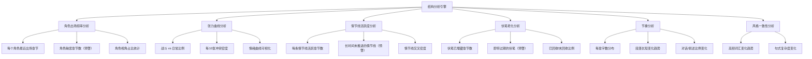

**UI 示例**：
```
┌──────────────────────────────────────────────────┐
│  结构分析报告 — 当前进度 45/500 章 (90万字)       │
├──────────────────────────────────────────────────┤
│  🔴 预警                                          │
│  ┌─────────────────────────────────────────────┐ │
│  │ ⚠️ 角色「苏晴」已连续 18 章未出场             │ │
│  │ ⚠️ 伏笔「锈色钥匙」已埋下 120 章未回收        │ │
│  │ ⚠️ 情节线「暗影议会内斗」已 25 章未推进        │ │
│  └─────────────────────────────────────────────┘ │
│                                                  │
│  📊 张力曲线                                      │
│  ▁▂▃▄▅▆▇█▇▆▅▄▃▂▁▂▃▄▅▆▇█▇▆▅▄▃▂▁               │
│  ↑最近30章  ← 战斗密集区        日常区 →          │
│                                                  │
│  📈 角色出场率                                     │
│  林夜 ████████████████░░░░ 82%                   │
│  苏晴 ██████░░░░░░░░░░░░░░ 32% ⚠️                │
│  夜无痕 ██████████░░░░░░░░ 48%                    │
│  白月 ████░░░░░░░░░░░░░░░░ 22%                   │
└──────────────────────────────────────────────────┘
```

### 11.5 自动世界书条目生成 (Auto WorldBook Entry)

**解决的问题**：AI 写作创造新实体后，用户需要手动维护世界书。

**工作流程**：
```
AI 写完一段内容
    ↓
后处理扫描器分析新内容
    ↓
检测到新出现的命名实体：
  - 新地名: "暗影深渊"
  - 新角色: "深渊守卫·卡尔"
  - 新物品: "影之核心"
    ↓
自动生成世界书条目草稿
  ├── 标题: 暗影深渊
  ├── 关键词: [暗影深渊, 深渊, 深渊守卫]
  ├── 内容: AI 从文中提取关键设定描述
  └── 分类: geography
    ↓
用户确认/编辑 → 正式加入世界书
```

**代码设计**：
```typescript
// src/lib/world-book/auto-generator.ts

interface EntityExtraction {
  entities: ExtractedEntity[];
}

interface ExtractedEntity {
  name: string;
  type: 'location' | 'character' | 'item' | 'event' | 'organization';
  context: string;          // 相关原文
  description: string;      // AI 提取的描述
  keywords: string[];       // 建议关键词
  suggestedCategory: string;
  confidence: number;       // 置信度
}

class WorldBookAutoGenerator {
  /**
   * 扫描新写的内容，提取潜在的世界书条目
   */
  async scanNewContent(content: string, existingEntries: WorldBookEntry[]): Promise<EntityExtraction>;

  /**
   * 根据提取结果生成世界书条目草稿
   */
  generateDraft(entity: ExtractedEntity): Partial<WorldBookEntry>;

  /**
   * 检测是否与已有条目重复
   */
  detectDuplicate(entity: ExtractedEntity, existingEntries: WorldBookEntry[]): boolean;
}
```

### 11.6 写作模式切换 (Writing Modes)

**解决的问题**：不同写作阶段需要不同的 AI 行为。

| 模式 | 适用阶段 | 温度 | 上下文 | 行为说明 |
|------|----------|------|--------|----------|
| 🚀 **草稿模式** | 初稿冲刺 | 0.6 | 精简上下文 | 快速推进情节，忽略文笔打磨，关注"写了什么" |
| ✨ **润色模式** | 精修阶段 | 0.8 | 完整上下文 | 关注句式、词汇、节奏、描写的精细调整 |
| 🎯 **聚焦模式** | 关键场景 | 0.7 | 聚焦上下文 | 聚焦当前场景深度描写，注入该场景相关的世界书 |

```typescript
type WritingMode = 'draft' | 'polish' | 'focus';

interface WritingModeConfig {
  temperature: number;
  contextStrategy: 'minimal' | 'full' | 'focused';
  styleGuideEmphasis: 'low' | 'high' | 'medium';
  worldBookDepth: 'shallow' | 'deep' | 'targeted';
  generationSpeed: 'fast' | 'balanced' | 'quality';
}

const WRITING_MODE_CONFIGS: Record<WritingMode, WritingModeConfig> = {
  draft: {
    temperature: 0.6,
    contextStrategy: 'minimal',
    styleGuideEmphasis: 'low',
    worldBookDepth: 'shallow',
    generationSpeed: 'fast',
  },
  polish: {
    temperature: 0.8,
    contextStrategy: 'full',
    styleGuideEmphasis: 'high',
    worldBookDepth: 'deep',
    generationSpeed: 'quality',
  },
  focus: {
    temperature: 0.7,
    contextStrategy: 'focused',
    styleGuideEmphasis: 'medium',
    worldBookDepth: 'targeted',
    generationSpeed: 'balanced',
  },
};
```

---

## 十二、补充高级特性（第二轮）

### 12.1 成本控制与 Token 预算系统

**解决的问题**：500 万字通过 API 生成，Token 消耗巨大，需要精确控制和预警。

#### Token 用量模型

```typescript
interface TokenCostModel {
  // 各层上下文平均消耗
  averageContextPerChapter: number;   // ~60K tokens
  averageGenerationPerChapter: number; // ~8K tokens
  totalChapters: number;              // 500
  
  // 成本估算
  estimateTotalCost(provider: string): CostEstimate;
  estimateCostPerChapter(provider: string): number;
}

interface CostEstimate {
  totalInputTokens: number;
  totalOutputTokens: number;
  estimatedCostUSD: number;
  estimatedCostCNY: number;
  byVolume: VolumeCost[];
}

interface TokenBudget {
  projectId: string;
  totalBudget: number;           // Token 总预算
  usedTokens: number;
  remainingTokens: number;
  budgetPerVolume: number;       // 每卷预算
  alertThreshold: number;        // 预警阈值 (%)
  status: 'normal' | 'warning' | 'critical';
}
```

#### 成本仪表盘

```
┌──────────────────────────────────────────────────┐
│  💰 Token 成本控制                                 │
├──────────────────────────────────────────────────┤
│  总预算: 500 万 tokens  |  已用: 120 万  |  剩余: 65% │
│  ████████████████░░░░░░░░░░░░░ 35%                │
│                                                    │
│  当前卷预算: 50 万 tokens                          │
│  当前卷已用: 32 万 tokens  ████████████████░░ 64%  │
│                                                    │
│  📊 按章节趋势                                     │
│  章1-10: ████░░ 4K/章                              │
│  章11-20: ██████ 6K/章                             │
│  章21-30: ████████ 8K/章 ⚠️ 上升趋势               │
│                                                    │
│  ⚙️ 优化建议                                       │
│  ├── 世界书注入可减少 15% (当前 10K → 目标 8.5K)   │
│  └── 热记忆可限制为2章 (当前3章 → 节省30%)          │
└──────────────────────────────────────────────────┘
```

### 12.2 修订工作流 (Revision Pipeline)

**解决的问题**：AI 生成后需要系统化的审核修改流程。

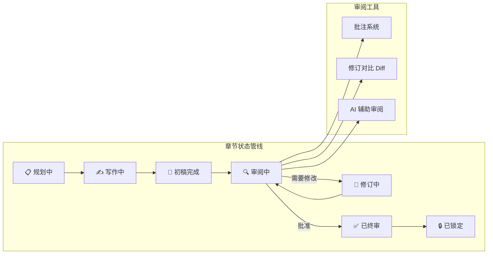

#### 批注系统

```typescript
interface Annotation {
  id: string;
  chapterId: string;
  userId: string;
  type: 'plot_hole' | 'inconsistency' | 'style_issue' | 'suggestion' | 'typo';
  severity: 'minor' | 'major' | 'critical';
  position: {
    startOffset: number;
    endOffset: number;
    text: string;
  };
  content: string;          // 批注内容
  resolved: boolean;
  createdAt: Date;
  resolvedAt?: Date;
}

interface Revision {
  id: string;
  chapterId: string;
  fromVersion: number;
  toVersion: number;
  changes: RevisionChange[];  // 具体修改点
  summary: string;            // 修改摘要
  appliedBy: 'user' | 'ai';
  status: 'pending' | 'applied' | 'rejected';
}
```

#### 章节状态管道

```prisma
model Chapter {
  // ... 原有字段
  status        String   @default("planned") // planned | writing | draft | reviewing | revising | approved | locked
  currentVersion Int     @default(1)
  lockedAt      DateTime?
  
  annotations   Annotation[]
  revisions     Revision[]
}

model ChapterVersion {
  id          String   @id @default(cuid())
  chapterId   String
  version     Int
  content     String   // 该版本的完整内容快照
  summary     String   // 版本变更摘要
  createdBy   String   // 'user' | 'ai' | 'ai_revision'
  createdAt   DateTime
}
```

### 12.3 层级摘要管道 (Progressive Summarization)

**解决的问题**：500 万字的逐级压缩，确保各层记忆系统有合适粒度的摘要。

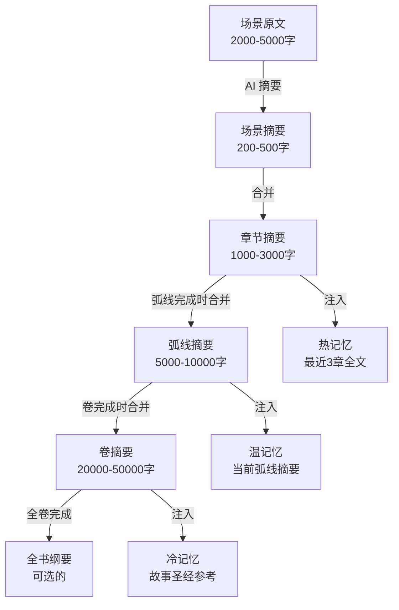

```typescript
interface SummaryPipeline {
  // 场景 → 场景摘要
  summarizeScene(scene: Scene): Promise<SceneSummary>;
  
  // 场景摘要 → 章节摘要
  summarizeChapter(scenes: SceneSummary[], chapter: Chapter): Promise<ChapterSummary>;
  
  // 章节摘要 → 弧线摘要
  summarizeArc(chapters: ChapterSummary[], arc: Arc): Promise<ArcSummary>;
  
  // 弧线摘要 → 卷摘要
  summarizeVolume(arcs: ArcSummary[], volume: Volume): Promise<VolumeSummary>;
  
  // 自动触发：场景写完 → 场景摘要 → 更新章节摘要 → ...
  autoPipeline(chapterId: string): Promise<void>;
}

interface ChapterSummary {
  chapterId: string;
  chapterNumber: number;
  title: string;
  summary: string;             // 3000字摘要
  keyEvents: string[];         // 关键事件列表
  newCharacters: string[];     // 本章新出场角色
  revealedFacts: string[];     // 本章揭示的真相
  emotionalArc: string;        // 本章情感曲线
}
```

### 12.4 母题追踪器 (Motif Tracker)

**解决的问题**：500 万字小说中，主题/象征/意象需要跨章节反复出现，形成呼应。

```typescript
interface Motif {
  id: string;
  projectId: string;
  name: string;              // 母题名称: "冰雪"
  type: 'symbol' | 'theme' | 'imagery' | 'recurring_element';
  description: string;       // "象征孤独与坚韧，在角色低谷时出现"
  
  // 每次出现
  appearances: MotifAppearance[];
  
  // 关联角色
  relatedCharacters: string[];
  
  // 关联事件
  relatedEvents: string[];
}

interface MotifAppearance {
  chapterId: string;
  chapterNumber: number;
  excerpt: string;           // 出现原文
  context: string;           // 出现时的情节背景
  variation: string;         // 本次变体: "暴风雪" / "冰晶" / "霜花"
  intensity: 1 | 2 | 3 | 4 | 5; // 强烈程度
}
```

**UI 示例**：
```
┌──────────────────────────────────────────────────┐
│  🎯 母题追踪                                      │
├──────────────────────────────────────────────────┤
│                                                    │
│  「冰雪」— 象征孤独与坚韧                           │
│  ━━━━━━━━━━━━━━━━━━━━━━━━━━━━━━━━━━━━━━━━━━━━━ │
│                                                    │
│  第3章  ●●○○○  风雪中独行                          │
│  第15章 ●●●○○  冰面上的血迹                        │
│  第30章 ●●○○○  梦境中的冰原                        │
│  第80章 ●●●●○  断臂在冰面爬行 ⭐ 高潮              │
│  第120章 ●●●○○  冰晶义肢初成                       │
│  第200章 ●●○○○  雪中告白（温暖化用）                │
│  第250章 ●●●●○  血脉觉醒·冰霜风暴 ⭐ 高潮          │
│  第350章 ●●○○○  回忆中的雪景                       │
│  第480章 ●●●●●  最终决战·暴风雪 ⭐ 全书最高潮       │
│                                                    │
│  出现频率: 每28章1次  |  强度趋势: 上升 ↗          │
│  关联角色: 林夜, 苏晴                              │
└──────────────────────────────────────────────────┘
```

### 12.5 章节状态管线 (Chapter Status Pipeline)

**解决的问题**：500 章需要清晰的状态管理，避免混乱。

```
状态流转图:

     ┌─────────┐
     │ 规划中   │ ← 场景级规划完成，等待写作
     └────┬────┘
          ↓
     ┌─────────┐
     │ 写作中   │ ← AI 正在写作或用户正在手动写
     └────┬────┘
          ↓
     ┌─────────┐
     │ 初稿完成 │ ← AI 初稿生成完毕，等待审阅
     └────┬────┘
          ↓
     ┌─────────┐ ──────────→ ┌─────────┐
     │ 审阅中   │ ← 批注/修订 → │ 修订中   │
     └────┬────┘             └────┬────┘
          ↓                       ↓
     ┌─────────┐              (返回审阅)
     │ 已终审   │ ← 用户确认通过
     └────┬────┘
          ↓
     ┌─────────┐
     │ 已锁定   │ ← 不可再修改，版本归档
     └─────────┘
```

**数据模型**：
```prisma
model ChapterStatusLog {
  id          String   @id @default(cuid())
  chapterId   String
  fromStatus  String
  toStatus    String
  triggeredBy String   // 'user' | 'ai' | 'system'
  note        String?
  createdAt   DateTime
}
```

**UI 批量管理**：
```
┌──────────────────────────────────────────────────────────┐
│  章节状态总览 — 卷1「冰霜初现」                            │
├──────┬──────────┬──────────┬──────┬──────────────────────┤
│ 章号 │ 标题     │ 字数     │ 状态 │ 操作                  │
├──────┼──────────┼──────────┼──────┼──────────────────────┤
│ 1    │ 冰霜觉醒  │ 12,340   │ 🔒   │ [查看] [版本]        │
│ 2    │ 北境学院  │ 10,890   │ ✅   │ [查看] [审阅]        │
│ 3    │ 初遇      │ 11,200   │ 🔄   │ [查看] [修订中]      │
│ 4    │ 暗流      │ 9,800    │ 📄   │ [审阅] [批注]        │
│ 5    │ 试炼      │ 0        │ 📋   │ [开始写作]           │
│ ...  │          │          │      │                      │
├──────┼──────────┼──────────┼──────┼──────────────────────┤
│      │ 总计     │ 44,230   │ 🔒 2 │ 📊 完成度: 40%      │
└──────┴──────────┴──────────┴──────┴──────────────────────┘
```

---

## 十三、完整功能清单

```
📋 小说作者 Agent — 完整功能矩阵

基础层:
├── ✅ 项目管理 (CRUD + 列表 + 仪表盘)
├── ✅ 多 LLM 支持 (OpenAI + Claude + 自定义)
├── ✅ 作者提示词 (默认 + 自定义 + 模板变量 + 编译器)
├── ✅ 沉浸式写作 (POV代入 + 知识边界 + 角色声音)
├── ✅ 卷/弧线/章节 三级结构
├── ✅ 场景级规划
└── ✅ Markdown 富文本编辑器

记忆层:
├── ✅ 热记忆 (滑动窗口 3-5章全文)
├── ✅ 温记忆 (弧线摘要)
├── ✅ 故事圣经 (角色/时间线/情节线/伏笔/风格)
├── ✅ 层级摘要管道 (场景→章节→弧线→卷)
├── ✅ Token 预算管理
└── ✅ 上下文构建器

世界书层:
├── ✅ 世界书条目管理 (关键词/优先级/排除过滤)
├── ✅ SillyTavern 风格动态注入
├── ✅ 角色→世界书自动同步
├── ✅ 自动世界书条目生成 (新实体检测)
└── ✅ 注入预览面板

写作层:
├── ✅ AI 续写 (单章)
├── ✅ AI 批量写作 (5-10章管道)
├── ✅ AI 多分支续写 (2-3个选项)
├── ✅ AI 扩写/润色
├── ✅ 写作模式切换 (草稿/润色/聚焦)
└── ✅ AI 助手对话面板

叙事管理层:
├── ✅ 角色管理 + 角色时间线
├── ✅ 情节线追踪器
├── ✅ 伏笔/回收看板
├── ✅ 母题追踪器 (主题/象征/意象)
├── ✅ 时间线可视化
└── ✅ 风格指南管理

分析层:
├── ✅ 结构分析仪表盘
├── ✅ 角色出场频率
├── ✅ 张力曲线
├── ✅ 情节线活跃度
├── ✅ 伏笔老化预警
├── ✅ 风格一致性检查
└── ✅ 一致性检查引擎

修订与管控层:
├── ✅ 章节状态管线 (规划→写作→初稿→审阅→终审→锁定)
├── ✅ 批注系统 (位置标记/分类/严重程度/解决状态)
├── ✅ 版本快照与回滚
├── ✅ 修订对比 Diff
└── ✅ 成本控制仪表盘

高级:
├── ✅ 全文搜索 (FTS5)
├── ✅ 导出 (TXT/PDF/EPUB/HTML)
├── ✅ 写作统计
├── ✅ Token 成本监控与预算预警
├── ✅ 数据备份/恢复
├── ✅ 多模型切换与配置
├── ✅ 成本控制仪表盘 (预算设置/用量预警/优化建议)
└── ✅ 章节状态批量管理 (总览/批量操作/完成度统计)

平台适配层:
├── ✅ 平台档案库 (番茄/起点/晋江/飞卢/七猫/自定义)
├── ✅ 小说初始化向导 (5步式: 选平台→设字数→取书名→写简介→生骨架)
├── ✅ AI 平台感知书名生成 (按平台风格优化)
├── ✅ AI 平台感知简介生成 (按平台规则优化)
├── ✅ 字数智能计算器 (总字数→卷数→章节数→每章字数)
├── ✅ AI 自动分卷分章 (含建议字数分配)
├── ✅ 平台风格注入 (写作时自动注入平台风格指南)
├── ✅ 内容红线检测 (平台审核规则自动规避)
├── ✅ Token 消耗预估算 (写作前就看到总成本)
└── ✅ 内容红线自动规避 (平台审核规则注入)

去AI味层:
├── ✅ 反AI味 Prompt 指令 (禁止模板句/禁止AI词汇/强制具体细节)
├── ✅ 生成参数动态调节 (Temperature/TopP/FrequencyPenalty)
├── ✅ AI味检测评分引擎 (0-100分, 自动重写高分段落)
├── ✅ 多样性后处理器 (句首/段落长度/词汇多样性检查)
├── ✅ 好/坏写作例子对比注入
└── ✅ 人类作者风格参考系统
```

---

## 十四、实施路线图

### 第一阶段：项目初始化与核心架构
- [ ] 1.1 初始化 Next.js 项目 (TypeScript + App Router)
- [ ] 1.2 配置 Tailwind CSS、shadcn/ui
- [ ] 1.3 配置 Prisma + SQLite，定义完整数据模型
- [ ] 1.4 实现基础布局组件（Sidebar、Topbar）
- [ ] 1.5 实现 LLM 适配器层（Base + OpenAI + Anthropic + Factory）

### 第二阶段：平台适配与小说初始化向导
- [ ] 2.1 实现平台档案库（PlatformProfile 数据模型 + 内置平台预设）
- [ ] 2.2 实现小说初始化向导 UI（5步式引导流程）
- [ ] 2.3 实现 AI 平台感知书名生成（含平台风格注入 Prompt）
- [ ] 2.4 实现 AI 平台感知简介生成（含平台规则注入 Prompt）
- [ ] 2.5 实现字数智能计算（总字数→卷数→章节数→每章字数）
- [ ] 2.6 实现 AI 自动分卷分章骨架生成
- [ ] 2.7 实现 AI 大纲生成（基于平台风格 + 题材设定）
- [ ] 2.8 实现 Token 消耗预估算（写作前展示预估成本）
- [ ] 2.9 实现平台风格注入到后续写作管线

### 第三阶段：五层记忆系统 + 层级摘要管道
- [ ] 3.1 实现热记忆管理（滑动窗口 + 自动更新）
- [ ] 3.2 实现温记忆管理（章节摘要自动生成）
- [ ] 3.3 实现故事圣经核心数据结构
- [ ] 3.4 实现上下文构建器（组装多层注入）
- [ ] 3.5 实现 Token 预算计算与截断
- [ ] 3.6 实现层级摘要管道（场景→章节→弧线→卷的逐级压缩）
- [ ] 3.7 实现摘要自动触发机制（场景写完→自动更新上层摘要）

### 第四阶段：世界书引擎
- [ ] 4.1 实现世界书数据模型和 CRUD API
- [ ] 4.2 实现世界书引擎核心（关键词扫描 + 优先级排序 + 排除过滤）
- [ ] 4.3 实现角色→世界书的自动同步
- [ ] 4.4 实现世界书管理页面
- [ ] 4.5 实现世界书注入预览面板

### 第五阶段：核心写作功能
- [ ] 5.1 实现项目管理（CRUD + 列表 + 仪表盘）
- [ ] 5.2 实现卷/弧线/章节层级结构管理
- [ ] 5.3 实现写作编辑器（Tiptap 集成）
- [ ] 5.4 实现 AI 助手面板
- [ ] 5.5 实现 Prompt 模板系统
- [ ] 5.6 实现 AI 续写功能（含完整上下文注入）
- [ ] 5.7 实现 AI 扩写/润色功能
- [ ] 5.8 实现 AI 新章节生成

### 第六阶段：场景规划与多分支续写
- [ ] 6.1 实现场景数据模型（Scene CRUD）
- [ ] 6.2 实现场景规划 UI（章节内场景列表）
- [ ] 6.3 实现 AI 从大纲生成场景计划
- [ ] 6.4 实现多分支续写（2-3个选项生成）
- [ ] 6.5 实现分支选择 UI（对比视图）

### 第七阶段：批量写作管道
- [ ] 7.1 实现 BatchWriteSession 数据模型
- [ ] 7.2 实现批量章节计划生成
- [ ] 7.3 实现批量 AI 写作（5-10章并发）
- [ ] 7.4 实现批量审阅 UI（章节列表 + 逐章审阅）
- [ ] 7.5 实现批量反馈 → 批量修正循环

### 第八阶段：角色与情节管理 + 母题追踪器
- [ ] 8.1 实现角色管理页面
- [ ] 8.2 实现角色时间线管理
- [ ] 8.3 实现情节线追踪器
- [ ] 8.4 实现伏笔管理看板
- [ ] 8.5 实现时间线可视化
- [ ] 8.6 实现母题数据模型（Motif/MotifAppearance）
- [ ] 8.7 实现母题追踪 UI（出现列表 + 强度热力图 + 频率趋势）
- [ ] 8.8 实现 AI 自动检测母题出现（写作后扫描识别新出现）

### 第九阶段：沉浸式写作系统
- [ ] 9.1 实现 POV 角色数据扩展（角色声音/思维方式/知识边界字段）
- [ ] 9.2 实现知识边界管理器 KnowledgeBoundaryManager
- [ ] 9.3 实现 StoryFact 追踪系统（谁在什么章节知道了什么）
- [ ] 9.4 实现沉浸式角色 Prompt 模板
- [ ] 9.5 实现多 POV 场景切换支持
- [ ] 9.6 实现知识边界过滤（拦截 AI 使用角色不该知道的信息）
- [ ] 9.7 实现默认提示词的沉浸式升级

### 第十阶段：作者提示词系统
- [ ] 10.1 实现 AuthorPrompt 数据模型和 API
- [ ] 10.2 实现默认作者提示词（沉浸式版本，含模板变量）
- [ ] 10.3 实现提示词编译器 PromptCompiler（变量替换 + 无变量追加）
- [ ] 10.4 实现提示词编辑器页面（双栏：编辑+实时预览）
- [ ] 10.5 实现提示词版本管理（历史版本回溯）
- [ ] 10.6 整合提示词编译器到上下文构建器（与记忆系统+沉浸式系统联动）

### 第十一阶段：一致性保障
- [ ] 11.1 实现一致性检查引擎
- [ ] 11.2 实现定期自动检查（每10章触发）
- [ ] 11.3 实现问题报告与追踪
- [ ] 11.4 实现风格指南管理
- [ ] 11.5 实现批量修正建议

### 第十二阶段：结构分析与世界书自动生成
- [ ] 12.1 实现结构分析引擎（角色出场/张力/情节线/伏笔）
- [ ] 12.2 实现结构分析仪表盘 UI
- [ ] 12.3 实现自动预警系统（角色失踪/伏笔过期/情节线停滞）
- [ ] 12.4 实现新实体检测（AI 写作后扫描）
- [ ] 12.5 实现自动世界书条目草稿生成
- [ ] 12.6 实现写作模式切换（草稿/润色/聚焦）

### 第十三阶段：修订工作流与章节状态管线
- [ ] 13.1 实现章节状态数据模型（planned/writing/draft/reviewing/revising/approved/locked）
- [ ] 13.2 实现章节状态流转逻辑与状态日志（ChapterStatusLog）
- [ ] 13.3 实现批注系统 Annotation（创建/解析/解决/跟踪）
- [ ] 13.4 实现修订对比视图（Diff 展示修改前后）
- [ ] 13.5 实现章节版本管理（ChapterVersion 快照/回滚/历史）
- [ ] 13.6 实现批量章节状态管理 UI（总览表格 + 批量操作 + 完成度统计）
- [ ] 13.7 实现 AI 辅助审阅（自动标注问题点 + 修改建议）

### 第十四阶段：高级功能（含成本控制）
- [ ] 14.1 多模型切换与配置
- [ ] 14.2 写作统计与 Token 成本监控仪表盘
- [ ] 14.3 成本控制与 Token 预算管理系统（预算设置/用量预警/优化建议）
- [ ] 14.4 导出功能（TXT/PDF/EPUB/HTML）
- [ ] 14.5 全文搜索（FTS5）
- [ ] 14.6 章节版本快照与回滚
- [ ] 14.7 数据备份与恢复

### 第十五阶段：优化与部署
- [ ] 15.1 流式输出体验优化
- [ ] 15.2 错误处理与重试机制
- [ ] 15.3 性能优化（大章节加载/渲染）
- [ ] 15.4 部署配置与文档

---

## 十五、关键技术决策

| 决策点 | 选择 | 理由 |
|--------|------|------|
| **记忆系统** | 五层架构 (Hot/Warm/StoryBible/WorldBook/Style) | 解决 500 万字超长上下文问题 |
| **数据库** | SQLite (Prisma) + FTS5 全文搜索 | 本地优先，无需额外服务 |
| **LLM 适配** | 适配器模式 | 灵活支持多模型 |
| **编辑器** | Tiptap (ProseMirror) | 富文本 + 可编程 API |
| **上下文构建** | 多层注入 + Token 预算控制 | 精确利用 LLM 上下文窗口 |
| **一致性保障** | 定期自动检查 + 故事圣经比对 | 系统性防止矛盾 |
| **世界书** | 关键词驱动动态注入 | 参考 SillyTavern 设计 |
| **流式输出** | SSE (Server-Sent Events) | 实时显示 AI 生成 |

---

## 十六、风险与缓解

| 风险 | 影响 | 缓解措施 |
|------|------|----------|
| Token 消耗巨大 | 成本高 | Token 预算管理 + 智能截断 + 仅注入必要上下文 |
| AI 仍会遗忘早期内容 | 前后矛盾 | 故事圣经持续维护 + 定期一致性检查 |
| 世界书条目过多 | 注入噪声 | 优先级排序 + Token 预算硬限制 + 排除过滤 |
| 长时期写作风格漂移 | 风格不统一 | 风格指南持续维护 + 每次写作注入风格规则 |
| 伏笔遗忘 | 情节漏洞 | 伏笔清单追踪 + 自动提醒未回收伏笔 |
| 500 万字数据量 | 性能问题 | 分页加载 + 索引优化 + 按卷归档 |
| API 中断/限流 | 写作中断 | 重试机制 + 自动切换模型 |
%%NEW_SECTION_START%%


---

## 十七、补充高级特性（第三轮）：平台适配与小说初始化工作流

### 17.1 解决的问题

传统写作工具缺少"平台意识"，作者需要自行研究平台规则、手动计算字数、自己憋书名简介。本系统将**平台适配前置到创作的第一步**，形成完整的小说初始化工作流：

\`\`\`
选择平台 → 设定总字数 → AI 取书名 → AI 写简介 → AI 生成大纲 → 自动分卷分章 → 按平台定每章字数 → 开始写作
\`\`\`

### 17.2 平台档案库 (Platform Profile)

#### 内置平台预设

| 平台 | 每章字数 | 典型总字数 | 风格特征 |
|------|---------|-----------|---------|
| 📱 番茄小说 | 2000-2500字 | 100万-500万 | 快节奏、每章留钩子、轻松直白 |
| 📚 起点中文网 | 3000-4000字 | 200万-500万 | 重世界观、慢热铺垫、细节丰富 |
| 💜 晋江文学城 | 3000-5000字 | 30万-150万 | 情感细腻、文笔要求高 |
| 🦅 飞卢小说网 | 2000-3000字 | 100万-300万 | 爽文节奏、脑洞大开 |
| 🐱 七猫小说 | 2000-2500字 | 80万-300万 | 类似番茄、节奏明快 |
| 🔧 自定义平台 | 用户自定义 | 用户自定义 | 用户自行编写风格指南 |

#### 数据模型

\`\`\`typescript
interface PlatformProfile {
  id: string;
  name: string;                    // 平台名称
  chapterWordCountMin: number;     // 每章最少字数
  chapterWordCountMax: number;     // 每章最多字数
  totalWordCountMin: number;       // 整本最少字数
  totalWordCountMax: number;       // 整本最多字数
  styleGuide: string;              // 风格指南（用于 Prompt 注入）
  commonGenres: string[];          // 热门题材
  contentRestrictions: string[];   // 内容红线/审核规则
  targetAudience: string;          // 目标读者群体
  chapterStructure: string;        // 章节结构建议
}
\`\`\`

### 17.3 小说初始化向导 (Novel Setup Wizard)

#### Step 1: 选择平台

\`\`\`
┌──────────────────────────────────────────────┐
│  📖 选择投稿平台                                │
├──────────────────────────────────────────────┤
│                                                │
│  [📱 番茄小说]  [📚 起点中文网]  [💜 晋江文学城]   │
│  [🦅 飞卢小说]  [🐱 七猫小说]  [🔧 自定义平台]    │
│                                                │
│  已选: 番茄小说                                 │
│  ├── 每章字数: 2000-2500字                     │
│  ├── 适合题材: 系统/重生/穿越/都市/玄幻          │
│  └── 风格: 快节奏, 每章结尾留悬念               │
│                                                │
│  [下一步]                                       │
└──────────────────────────────────────────────┘
\`\`\`

#### Step 2: 设定总字数

\`\`\`
┌──────────────────────────────────────────────┐
│  ✍️ 设定小说规模                               │
├──────────────────────────────────────────────┤
│                                                │
│  目标总字数: [  300  ] 万字                     │
│  平台建议范围: 100万-500万                      │
│                                                │
│  📊 系统自动计算:                               │
│  ├── 预估章节数: 3000000 ÷ 2500 = 1200 章     │
│  ├── 建议分卷: 6卷 (每卷200章 ≈ 50万字)        │
│  └── 预估 Token 消耗: ≈ 7200万 tokens         │
│      ├── 估算费用 (GPT-4o): ≈ $720 USD        │
│      └── 估算费用 (Claude 3.5): ≈ $360 USD    │
│                                                │
│  [上一步]                    [下一步]           │
└──────────────────────────────────────────────┘
\`\`\`

#### Step 3: AI 取书名

\`\`\`
┌──────────────────────────────────────────────┐
│  🏷️ AI 生成书名 (基于番茄小说风格)              │
├──────────────────────────────────────────────┤
│                                                │
│  请输入题材/核心设定:                           │
│  [  重生+系统+都市  ]                          │
│                                                │
│  🤖 AI 推荐书名:                               │
│                                                │
│  ① 📌 《重生2010：从签到系统开始》              │
│     → 点击率预测: ★★★★★  番茄热门命名公式       │
│                                                │
│  ② 《我的系统能无限签到》                       │
│     → 点击率预测: ★★★★                        │
│                                                │
│  ③ 《重回2010：签到系统带我逆袭》               │
│     → 点击率预测: ★★★★                        │
│                                                │
│  [🔄 重新生成]  [✏️ 手动输入]  [确认书名]       │
└──────────────────────────────────────────────┘
\`\`\`

#### Step 4: AI 写简介

\`\`\`
┌──────────────────────────────────────────────┐
│  📝 AI 生成小说简介 (番茄风格)                  │
├──────────────────────────────────────────────┤
│                                                │
│  书名: 《重生2010：从签到系统开始》              │
│                                                │
│  🤖 AI 生成的简介:                             │
│  ┌──────────────────────────────────────────┐ │
│  │ 林逸重生了，回到2010年高考前夕。             │ │
│  │ 前世他是任人欺辱的穷小子，                   │ │
│  │ 这一世…他激活了【神级签到系统】！            │ │
│  │                                            │ │
│  │ 叮！签到成功，获得【万能高考答题卡】！       │ │
│  │ 叮！签到成功，获得【神级医术】！             │ │
│  │ 叮！签到成功，获得【商业帝国启动资金】！     │ │
│  │                                            │ │
│  │ 校花看轻他？商圈大佬踩他？                   │ │
│  │ 且看他如何签到成神，走上人生巅峰！           │ │
│  └──────────────────────────────────────────┘ │
│                                                │
│  [🔄 重新生成]  [✏️ 手动编辑]  [确认简介]       │
└──────────────────────────────────────────────┘
\`\`\`

#### Step 5: AI 生成完整骨架

\`\`\`
┌──────────────────────────────────────────────┐
│  📋 AI 生成大纲与分卷                           │
├──────────────────────────────────────────────┤
│                                                │
│  总字数: 300万字 | 6卷 | 每卷约50万字          │
│                                                │
│  卷1: 校园崛起 (1-200章)                       │
│  ├── 主线: 高考翻身 + 系统觉醒期               │
│  ├── 字数: 50万字 | 每章2500字                │
│  └── 关键节点: 高考 → 大学入学 → 初遇女主      │
│                                                │
│  卷2: 都市风云 (201-400章)                     │
│  ├── 主线: 商业起步 + 势力冲突                 │
│  ├── 字数: 50万字 | 每章2500字                │
│  └── 关键节点: 创立公司 → 第一次危机 → 突破    │
│                                                │
│  ... (后续卷类似)                              │
│                                                │
│  [🔄 重新生成]  [✏️ 编辑大纲]  [确认并开始写作]  │
└──────────────────────────────────────────────┘
\`\`\`

### 17.4 Prompt 模板：平台感知书名生成

\`\`\`typescript
interface TitleGenerationInput {
  platform: PlatformProfile;
  genre: string;
  keywords: string[];
  targetAudience: string;
}

const TITLE_GENERATION_PROMPT = \`
你是一位熟悉{platform}小说平台的金牌编辑。
请根据以下信息，生成5个符合{platform}平台风格的小说书名。

题材: {genre}
核心关键词: {keywords}
目标读者: {targetAudience}

{platform}的书名风格指南:
- {styleGuide}

要求:
1. 书名必须包含核心关键词或暗示
2. 每个书名后附上点击率预测（1-5星）
3. 分析每个书名吸引读者的原因
4. 参考{platform}当前热门榜单的命名规律
\`;
\`\`\`

### 17.5 Prompt 模板：平台感知简介生成

\`\`\`typescript
const SYNOPSIS_PROMPT = \`
你是一位熟悉{platform}平台的金牌编辑。
请根据书名《{title}》和以下设定，撰写一份吸引人的小说简介。

题材: {genre}
核心设定: {premise}

{platform}的简介风格指南:
- {styleGuide}
- 章节字数要求: {chapterWordCountMin}-{chapterWordCountMax}字
- 内容红线: {contentRestrictions}

要求:
1. 开头必须有强冲突或强悬念
2. 使用{platform}平台流行的句式结构
3. 控制在200-300字以内
4. 必须包含"爽点"提示
5. 每段末尾留悬念
\`;
\`\`\`

### 17.6 平台适配 → 后续系统的数据传递

\`\`\`
平台适配系统的输出将直接传递给后续模块：

平台配置
  ├── 每章字数 → 写入 Project.chapterWordCount
  ├── 风格指南 → 注入写作 Prompt 的 system message
  ├── 内容红线 → 注入一致性检查器
  └── 审核规则 → 注入 AI 审阅模块

小说骨架
  ├── 书名 → Project.title
  ├── 简介 → Project.description
  ├── 总字数 → Project.totalWordCount
  ├── 卷划分 → Volume[] (自动创建)
  ├── 章划分 → Chapter[] (自动创建, 含建议字数)
  └── 大纲 → PlotOutline (自动生成)
\`\`\`

### 17.7 推荐理由

| 优势 | 说明 |
|------|------|
| 🎯 **降低创作门槛** | 新手作者不需要研究平台规则，AI 一步到位 |
| 📈 **提高签约率** | 书名/简介/大纲都针对平台优化，更易通过审核 |
| 🔄 **全链路自动化** | 从选平台到开始写作，一个向导完成 |
| 📊 **成本可控** | 提前看到 Token 估算，避免写到一半发现超预算 |
| 🔧 **灵活扩展** | 可随时添加新平台配置，无需改代码 |
